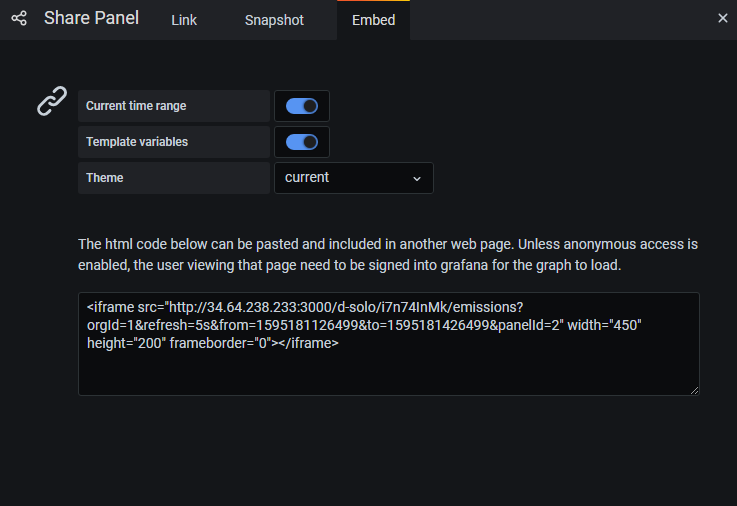

# 문제 해결

## 그라파나 대시보드를 외부에서 사용하기

iframe으로 대시보드를 가져오기 위해서는 먼저 패널에서 share버튼을 누른다.


그다음 embed 카테고리에서 iframe 태그로 작성된 코드를 복사하여 html에 붙인다.



이때, 해당 링크에서 연결을 거부했다는 메세지가 뜬다.
이를 해결하기 위해서는 그라파나가 켜진 리눅스 서버에서 /etc/grafana/grafana.ini 파일을 열어서 권한을 수정해야 한다.

```shell script
[security]
...
allow_embedding = true
```

```shell script
[auth.anonymous]
enabled = true
```

이제 iframe 태그가 정상 작동한다.